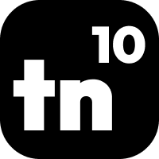

<h1 align="center">
  Hi
  
  , I'm Tejas Nikhar
</h1>

<h3 align="center">
  Full-Stack Developer | Scalable Systems & DevOps
</h3>

<br>

<div align="center">
  
  
  
</div>

<br>

<h2 align="center">👨‍💻 About Me</h2>

```golang
package main

import (
  "fmt"
)

func main() {
  bio := GetBio()
  fmt.Println(bio)
}

func GetBio() string {
  return `
  - 🏦 I'm currently working on improving my skills.
  - 🤔 I code in JavaScript (.js), TypeScript (.ts), Go (.go), and Python (.py).
  - 🌱 I’m currently learning about monitoring 📊 and observability 🔍.
  - 💬 Talk to me about football ⚽, gadgets 📱, anime 🎥, or anything tech-related 🤩.
  - 😄 Pronouns: He/Him.
  - 📝 I try to write articles on Medium, DEV, and my personal blog 😉.
  `
}
```

<h2 align="center">🌐 Connect with Me</h2>

<p align="center" style="font-size: 1.1rem;">
💡 Let's build, collaborate, and share ideas! Feel free to reach out through any of the platforms below.
</p>

<hr style="width: 60%; border: 1px solid #333; margin: 20px auto;">

<h3 align="center">🚀 Professional & Social</h3>

<div align="center">

[](https://x.com/tejastn10)
[](https://www.linkedin.com/in/tejastn10/)
[](https://github.com/tejastn10)

</div>

<hr style="width: 60%; border: 1px solid #333; margin: 20px auto;">

<h3 align="center">✍️ Content & Writing</h3>

<div align="center">

[](https://tejastn10.com)
[](https://tejastn10.medium.com)
[](https://dev.to/tejastn10)

</div>
